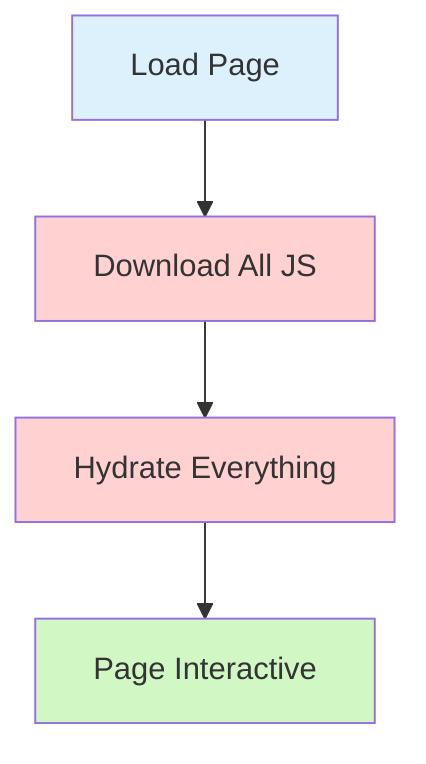
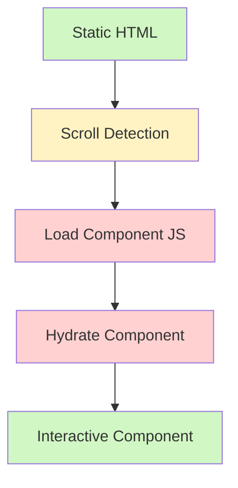
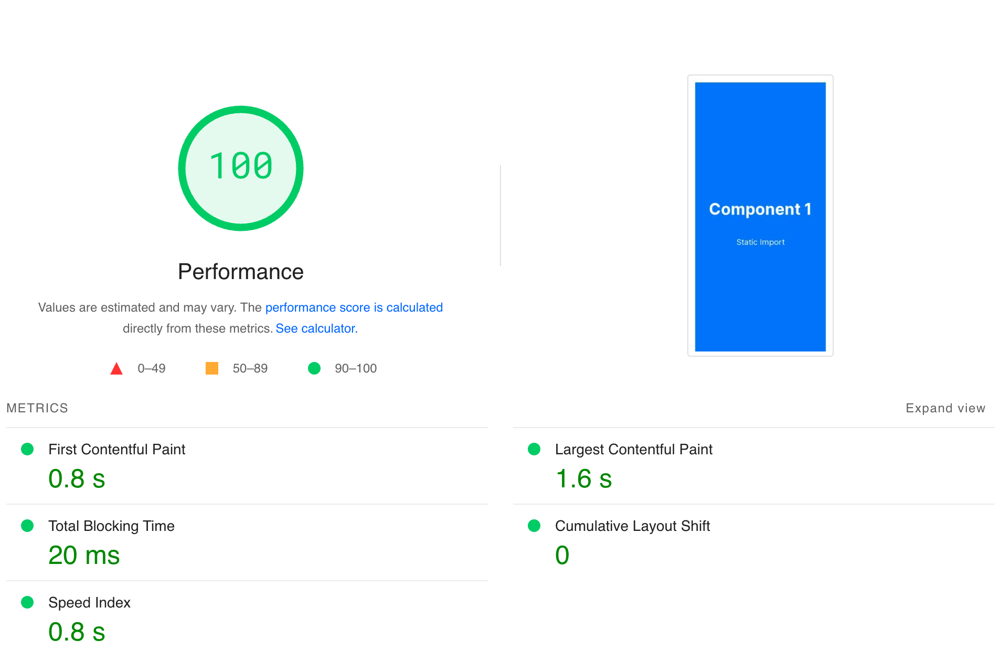

⚠️ **Pages Directory Only**  
This package is designed for Next.js Pages Directory, where streaming isn't available. If you're using App Directory, use [built-in streaming](https://nextjs.org/learn/dashboard-app/streaming) for better results.

---

<div align="center">
  <a href="https://next-lazy-hydration-on-scroll.wrotek.dev/">
    
  </a>

  <h1 align="center">next-lazy-hydration-on-scroll</h1>

  <p align="center">
    <strong>Supercharge your Next.js app performance ⚡️</strong>
    <br />
    Load components only when users need them
    <br />
    <br />
    ⚡️ Lower TBT • 📦 Smaller Bundle • 🚀 Improved Performance
    <br />
    <br />
    <a href="https://next-lazy-hydration-on-scroll.wrotek.dev/">View Demo</a>
  </p>
</div>

## Quick Start

### Installation

```bash
npm install next-lazy-hydration-on-scroll
# or
yarn add next-lazy-hydration-on-scroll
# or
pnpm add next-lazy-hydration-on-scroll
```

### Basic Usage

```tsx
import { lazyHydrate } from 'next-lazy-hydration-on-scroll'

// Wrap your component with lazyHydrate
const LazyComponent = lazyHydrate(() => import('./components/HeavyComponent'), {
  LoadingComponent: () => <div>Loading...</div>, // Optional
})

// Use it in your page
export default function Page() {
  return (
    <div>
      <header>Always hydrated</header>

      {/* This will hydrate only when scrolled into view */}
      <LazyComponent />

      {/* You can wrap multiple components */}
      <LazyComponent />
      <LazyComponent />
    </div>
  )
}
```

## Understanding the Process

### What is Hydration?

When you visit a Next.js website:

1. The server sends HTML that you can see immediately (like a static webpage)
2. Then it sends JavaScript to make everything interactive:
   - Makes buttons clickable
   - Enables form submissions
   - Activates React hooks (useEffect, useState, etc.)
   - Sets up event listeners

Let's look at how this package transforms the traditional hydration process:

### The Traditional Approach

By default, Next.js loads and hydrates all components at once, even those not visible on screen. This leads to several issues:

- Slow down initial page load
- Delay page interactivity
- High memory usage during hydration

The diagram below shows the blocking nature of traditional hydration:



🔴 Red boxes indicate operations that delay interactivity  
🟢 Green box shows when users can finally interact with the page

### The Solution ⚡️

This package breaks down the hydration process into stages:

1. Shows static content instantly
2. Detects when you scroll to components
3. Loads and hydrates components only when needed
4. Keeps your page fast and efficient



This approach provides many (some not obvious) benefits:

- Reduces Total Blocking Time (TBT) by splitting hydration work
- Reduces initial JavaScript bundle size
- Components with data fetching (useEffect, SWR, React Query) only trigger requests when hydrated

## Performance Impact 📊

The key improvement is in Total Blocking Time (TBT), which measures how long the main thread is blocked, preventing user interactions. By hydrating components gradually:

1. **Initial Load:**

   - Only essential components are hydrated
   - Main thread stays responsive
   - Users can interact with visible content faster

2. **Resource Usage:**

   - JavaScript is parsed and executed in smaller chunks
   - Memory usage stays lower
   - Network requests are distributed over time

3. **Data Fetching:**
   - Components that fetch data only do so when hydrated
   - Saves bandwidth for unseen components

<div align="center">
  <table>
    <tr>
      <th>With Lazy Hydration ✨</th>
      <th>Without Lazy Hydration</th>
    </tr>
    <tr>
      <td>
        
      </td>
      <td>
        
      </td>
    </tr>
    <tr>
      <td>✓ Faster Time to Interactive</td>
      <td>× Longer Loading Times</td>
    </tr>
    <tr>
      <td>✓ Lower Memory Usage</td>
      <td>× Higher Memory Usage</td>
    </tr>
    <tr>
      <td>✓ Better User Experience</td>
      <td>× Potential UI Freezes</td>
    </tr>
  </table>
</div>

## Implementation Notes ⚙️

### File Structure Requirements

- Keep components in separate files
- **Avoid barrel files** (index.ts that re-exports components):

  ```ts
  // ❌ Don't use barrel files like this:
  // components/index.ts
  export { ComponentA } from './ComponentA'
  export { ComponentB } from './ComponentB'

  // This will bundle all components together, defeating lazy loading
  ```

  ```ts
  // ✅ Instead, import directly:
  import { ComponentA } from './components/ComponentA'
  import { ComponentB } from './components/ComponentB'
  ```

This is important because webpack code splits on file boundaries. When using barrel files, all re-exported components get bundled into a single chunk, defeating the purpose of lazy loading.

### Common Misconceptions

- **next/dynamic alone isn't enough:**

  ```tsx
  // ❌ This still executes on initial load:
  const Component = dynamic(() => import('./Component'))

  function Page() {
    return <Component /> // Component is loaded immediately
  }

  // ✅ This works as expected:
  function Page() {
    const [show, setShow] = useState(false)
    return show && <Component /> // Component loads only when show is true
  }
  ```

  Unless the component is conditionally rendered, `next/dynamic` will still load and hydrate it on initial page load. This package uses IntersectionObserver and a few tweaks to enable pre-rendering while deferring hydration.

### Next.js Compatibility

- Perfect for Pages Router
- For App Router, use built-in streaming
- Works with Next.js 12 and above

## Common Questions

### Q: Does it affect SEO?

A: No! Content is still pre-rendered, so search engines see everything immediately.

### Q: What's the browser support?

A: Works in all modern browsers that support IntersectionObserver (IE11+ with polyfill).

---

<div align="center">
  <p>
    <strong>Made with ❤️ for better web performance</strong>
    <br />
    <small>Questions? Issues? Visit the <a href="https://github.com/woywro/next-lazy-hydration-on-scroll">GitHub repository</a></small>
  </p>
</div>
